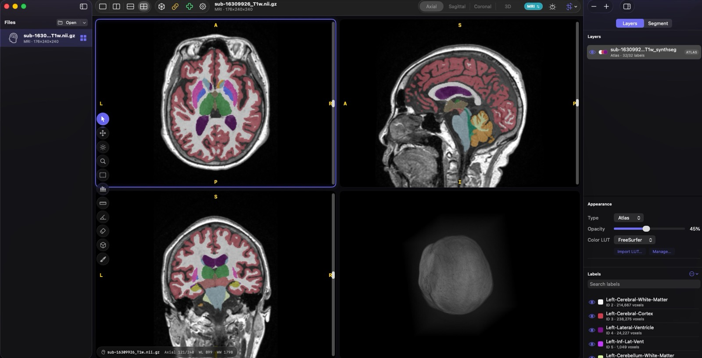

<p align="center">
  
</p>

<h1 align="center">OpenDicomViewer</h1>

<p align="center">
  <strong>A free, native macOS DICOM viewer — designed not just for use, but for adaptation.</strong><br>
  In the era of AI, everyone can customize open-source software to meet their own needs.<br>
  Fork it, modify it with an AI assistant, and make it yours.
</p>

<p align="center">
  <a href="https://jnheo-md.github.io/open-dicom-viewer">Website</a> &middot;
  <a href="https://github.com/jnheo-md/open-dicom-viewer/releases/latest/download/OpenDicomViewer.dmg">Download DMG</a> &middot;
  <a href="https://github.com/jnheo-md/open-dicom-viewer/releases">Releases</a>
</p>



## Why OpenDicomViewer?

- **Free and open source** — MIT licensed, no restrictions on use or modification
- **Native macOS** — Built with SwiftUI and Metal, no Electron or web overhead
- **Fast** — Instant first-image display with background loading; images appear before the study finishes scanning
- **Multi-panel layouts** — Side-by-side, stacked, and quad views with synchronized scrolling and zoom
- **Clinical measurement tools** — Ruler, angle, and ROI statistics with real-time dashed preview lines
- **Designed for customization** — Clean, readable architecture that's easy to fork and adapt, including with AI coding assistants

## Features

- **Fast DICOM Parsing** — Pure-Swift parser with incremental scanning; first image displays instantly while the rest loads in the background
- **Multi-Panel Layouts** — Single, side-by-side, stacked, and quad arrangements with drag-and-drop series assignment
- **MPR & 3D Brain Rendering** — One-click axial/sagittal/coronal views plus interactive Metal direct-volume rendering with drag rotation and density control
- **Window/Level** — Right-click drag, W/L tool, auto W/L, and ROI-based W/L with a live histogram overlay
- **Measurement Tools** — Ruler, angle, and ROI statistics with real-time preview lines
- **Synchronized Scrolling & Zoom** — Link panels to scroll to the same anatomical position using z-location matching
- **Cross-Reference Lines** — Overlay showing where other panels' slice planes intersect the current view
- **DICOM Tag Inspector** — Browse all metadata tags for the active image
- **Cursor Readout** — Real-time HU value and coordinates under the cursor
- **Scrollbar Thumbnails** — Hover the scrollbar to preview any slice
- **JPEG 2000 Support** — Compressed transfer syntaxes via DCMTK + OpenJPEG

## Quick Start

### For Users

Download the latest `.dmg` from [Releases](../../releases), open it, and drag OpenDicomViewer to your Applications folder.

> The app is signed and notarized — it will open without any Gatekeeper warnings.

### For Developers

**Prerequisites:** macOS 14.0+ (Sonoma), Xcode 15+ (or Swift 5.9+ toolchain), Apple Silicon Mac (arm64).

```bash
# Clone and build
git clone https://github.com/jnheo-md/open-dicom-viewer.git
cd open-dicom-viewer

# Build release and package as .app bundle
./scripts/package_app.sh

# Install (optional)
cp -r OpenDicomViewer.app /Applications/
```

To run the test suite:

```bash
swift test
```

Pre-built static libraries for DCMTK and OpenJPEG are included in `libs/`. To rebuild them from source (e.g., for a different architecture):

```bash
./scripts/setup_native_deps.sh
```

## Keyboard Shortcuts

### Navigation

| Key | Action |
|-----|--------|
| `Up` / `Down` | Previous / next image in series |
| `Left` / `Right` | Previous / next series |
| `Scroll` | Navigate slices |
| `Page Up` / `Page Down` | Skip 10 images |
| `Home` / `End` | Jump to first / last image |
| `Tab` | Cycle active panel |
| `Double-click` | Toggle panel fullscreen |

### Layout

| Key | Action |
|-----|--------|
| `1` / `2` / `3` / `4` | Single / side-by-side / stacked / quad |
| `Cmd+1` - `Cmd+4` | Layout switching (menu bar) |
| `Cmd+Shift+M` | MPR layout |

### Tools

| Key | Tool |
|-----|------|
| `V` | Select (default pointer) |
| `P` | Pan |
| `W` | Window/Level |
| `Z` | Zoom |
| `O` | ROI Window/Level |
| `S` | ROI Statistics |
| `D` | Ruler (distance) |
| `N` | Angle |
| `E` | Eraser |

### Display

| Key | Action |
|-----|--------|
| `A` | Auto window/level |
| `I` | Invert image |
| `F` | Fit to window |
| `R` | Reset view (zoom, pan, W/L) |
| `H` | Flip horizontal |
| `]` or `.` | Rotate clockwise 90° |
| `[` or `,` | Rotate counter-clockwise 90° |

### Overlays & Multi-Panel

| Key | Action |
|-----|--------|
| `T` | Toggle DICOM tag inspector |
| `X` | Toggle cross-reference lines |
| `L` | Toggle synchronized scrolling & zoom |
| `Shift` (hold) | Show group selection overlay |
| `Escape` | Clear group selection |

### Mouse Actions

| Input | Action |
|-------|--------|
| Left-click | Activate panel / tool action |
| Right-drag | Adjust Window/Level |
| Scroll wheel | Navigate slices |
| Option/Ctrl + Left-drag | Pan (any tool) |
| Option/Ctrl + Scroll | Zoom in/out |
| Shift (hold) + Click | Toggle panel group selection |
| Double-click | Toggle fullscreen panel |
| Drag from sidebar | Assign series to panel |
| Drag from Finder | Open DICOM file/folder |

## Architecture

```
Sources/
├── OpenDicomViewer/          # Main application target
│   ├── App.swift                 # App entry point, menu bar commands
│   ├── ContentView.swift         # Root view: sidebar + detail split
│   ├── DICOMModel.swift          # Core model: loading, caching, panel management
│   ├── SimpleDICOM.swift         # Pure-Swift DICOM parser (no DCMTK dependency)
│   ├── MultiPanelContainer.swift # Multi-panel grid, per-panel overlays & gestures
│   ├── PanelState.swift          # Per-panel state: series, W/L, zoom, metadata
│   ├── LayoutToolbar.swift       # Floating layout/link/crossref toolbar
│   ├── CrossReferenceOverlay.swift # Slice intersection lines between panels
│   ├── MPREngine.swift           # CPU-based multi-planar reconstruction
│   ├── MetalVolumeRenderer.swift # GPU ray-marched 3D direct-volume rendering
│   ├── VolumeData.swift          # 3D voxel buffer with affine transforms
│   ├── ViewerControlBar.swift    # MPR/3D mode, W/L, layout, and transform controls
│   ├── HelpView.swift            # In-app help viewer
│   ├── TagView.swift             # DICOM tag list view
│   ├── Extensions.swift          # Collection safe-subscript helper
│   └── WindowAccessor.swift      # NSWindow customization (hidden titlebar)
└── DCMTKWrapper/             # Objective-C++ bridge to DCMTK
    ├── DCMTKHelper.mm            # DCMTK image decoding + JPEG2000 fallback
    └── include/
        └── DCMTKHelper.h         # Public C/ObjC interface
```

### Key Design Decisions

- **Dual Parser Strategy**: A fast pure-Swift parser (`SimpleDICOM.swift`) handles tag reading and metadata extraction during directory scanning, while the DCMTK wrapper handles pixel data decoding for complex transfer syntaxes.
- **Panel-Based Architecture**: Each panel (`PanelState`) owns its own image, W/L, zoom, and metadata state. The model (`DICOMModel`) manages shared resources (series data, caches, queues) and coordinates between panels.
- **Spatial Synchronization**: Linked scrolling uses physical z-location matching rather than proportional index matching, so panels showing different series display the same anatomical position.
- **NSView for Interaction**: Mouse gesture handling uses `NSViewRepresentable` wrapping a custom `NSView` subclass for reliable AppKit-level event handling (W/L drag, zoom, pan, annotations).

## Customization Guide

OpenDicomViewer is designed to be straightforward to customize — whether you're adding features manually or working with an AI coding assistant. Here's where to look for common changes:

| What you want to do | Where to look |
|---|---|
| **Add a new tool** | Define it in the `ActiveTool` enum in `PanelState.swift`, add mouse handling in `MultiPanelContainer.swift`, and add a button to the tool palette (also in `MultiPanelContainer.swift`) |
| **Add a keyboard shortcut** | Add an `.onKeyPress` handler in `ContentView.swift` |
| **Modify overlays** | Edit `AnnotationOverlay` or `InfoOverlay` in `MultiPanelContainer.swift` |
| **Change panel behavior** | Per-panel state lives in `PanelState.swift`; cross-panel coordination is in `DICOMModel.swift` |
| **Add a menu bar command** | Add commands in `App.swift` |
| **Modify cross-reference lines** | Edit `CrossReferenceOverlay.swift` |

The codebase uses clear naming conventions and minimal abstraction layers, making it well-suited for AI-assisted development. Fork the project, describe what you want to change, and point your AI assistant at the relevant files above.

## Contributing

Contributions are welcome! Whether it's a bug fix, new feature, or documentation improvement — all PRs are appreciated.

1. Fork the repository
2. Create a feature branch (`git checkout -b feature/my-feature`)
3. Commit your changes (`git commit -am 'Add my feature'`)
4. Push to the branch (`git push origin feature/my-feature`)
5. Open a Pull Request

If you find a bug or have a feature request, please [open an issue](../../issues).

## License

This project is licensed under the MIT License — see [LICENSE](LICENSE) for details.

DCMTK is licensed under the BSD license. OpenJPEG is licensed under BSD-2-Clause. See [THIRD_PARTY_LICENSES.md](THIRD_PARTY_LICENSES.md) for full license texts.

## Dependencies

| Library | Version | Purpose | License |
|---------|---------|---------|---------|
| [DCMTK](https://dicom.offis.de/dcmtk.php.en) | 3.6.8 | DICOM image decoding, JPEG/JPEG-LS decompression | BSD |
| [OpenJPEG](https://www.openjpeg.org/) | 2.5.0 | JPEG 2000 decompression | BSD-2-Clause |

Both are included as pre-built static libraries (`libs/`) and linked at compile time via Swift Package Manager.
